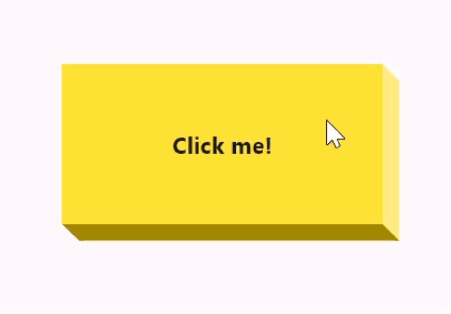

# popped_button

This package creates a 3d popped button

## Preview



## Usage
```dart
PoppedButton(
    depth: 10.5,
    color: Colors.yellow,
    child: Center(
        child: Text(
            "Click me!",
            style: TextStyle(fontWeight: FontWeight.bold),
        ),
    ),
    onPressed: () {
        debugPrint("Pressed");
    },
)
```

## Contributing

If you have read up till here, then 🎉🎉🎉. There are couple of ways in which you can contribute to
the growing community of `popped_button.dart`.

- Pick up any issue marked with ["good first issue"](https://github.com/TamilKannanCV-personal/popped_button/issues?q=is%3Aissue+is%3Aopen+label%3A%22good+first+issue%22)
- Propose any feature, enhancement
- Report a bug
- Fix a bug
- Write and improve some **documentation**. Documentation is super critical and its importance
  cannot be overstated!
- Send in a Pull Request 😊
